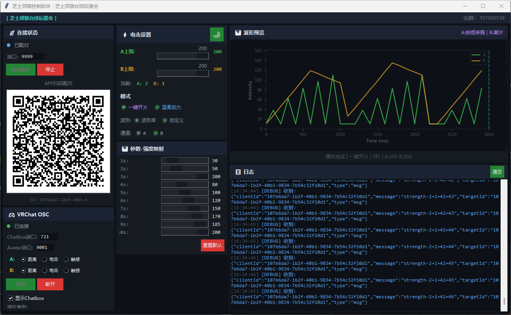

# 芝士郊狼控制软件

VRChat + DG-LAB 设备联动控制工具。通过监控 VRChat 日志和 OSC Avatar 参数，自动触发 DG-LAB 电击设备，并在 VRChat Chatbox 中实时显示状态。

## 功能

- **DG-LAB 设备控制** - 通过 WebSocket 连接 DG-LAB APP，支持电击波形发送和强度控制
- **VRChat 日志监控** - 实时读取 VRChat 日志，检测电击事件并自动触发
- **Avatar OSC 参数** - 接收 VRChat Avatar OSC 参数，支持距离/电击/触感三种模式
- **Chatbox 状态显示** - 实时在 VRChat 聊天框中显示当前模式和强度信息
- **波形预览** - 动态波形预览，带播放动画和游标
- **多主题** - 支持深色/浅色主题切换
- **参数映射** - 可自定义电击秒数与强度的映射关系
- **本地设置持久化** - 所有配置自动保存到 `settings.json`

## 截图



## 快速开始

### 安装依赖

```bash
pip install -r requirements.txt
```

> 注意：需要 Python 3.10+，websockets 库请使用 12.0 版本（`pip install websockets==12.0`）

### 启动

```bash
python main.py
```

### 连接 DG-LAB APP

1. 启动软件后自动生成二维码
2. 打开 DG-LAB APP → 扫描二维码
3. 连接成功后自动将强度设为上限

### 连接 VRChat

1. 启动 VRChat
2. 软件自动启动 OSC 服务（Chatbox 端口 9000，Avatar 端口 9001）
3. 在 OSC 面板中配置 Avatar 参数路径

## 构建 EXE

```bash
build.bat
```

构建完成后生成 `dist/芝士郊狼控制软件.exe`。

## 项目结构

```
├── main.py              # 入口
├── app.py               # 应用主逻辑
├── ws_client.py         # DG-LAB WebSocket 服务器（v2 协议）
├── avatar_handler.py    # VRChat Avatar OSC 处理器
├── waveform.py          # 波形生成
├── waveform_library.py  # 预设波形库
├── log_monitor.py       # VRChat 日志监控
├── settings.py          # 设置管理
├── themes.py            # 主题配置
├── gui/                 # GUI 面板
│   ├── main_window.py
│   ├── connection_panel.py
│   ├── settings_panel.py
│   ├── mapping_panel.py
│   ├── waveform_panel.py
│   ├── osc_panel.py
│   └── console_panel.py
└── build.bat            # 构建脚本
```

## 依赖

| 库 | 用途 |
|---|---|
| websockets (==12.0) | DG-LAB WebSocket 通信 |
| python-osc | VRChat OSC 收发 |
| matplotlib | 波形预览 |
| qrcode + Pillow | 二维码生成 |
| customtkinter | GUI（未使用，保留兼容） |

## 协议

基于 [DG-LAB SOCKET v2 协议](https://github.com/DGLab-Project/DG-LAB-SOCKET-v2)，与 DG-LAB 官方 APP 兼容。

## 许可

MIT License
